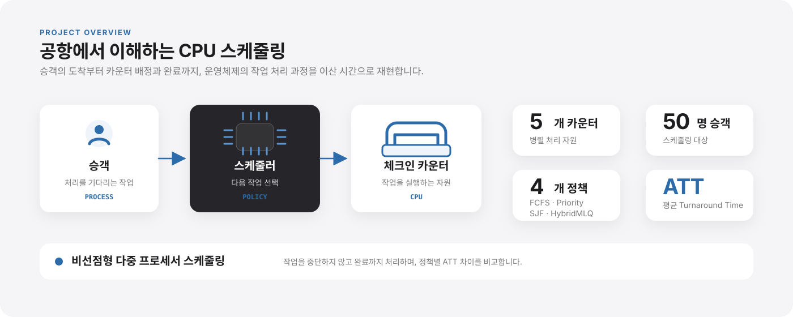
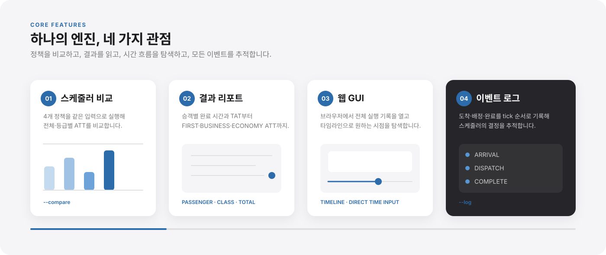
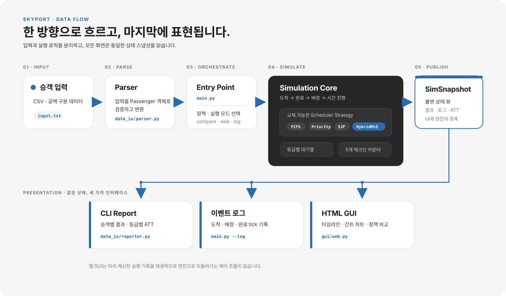
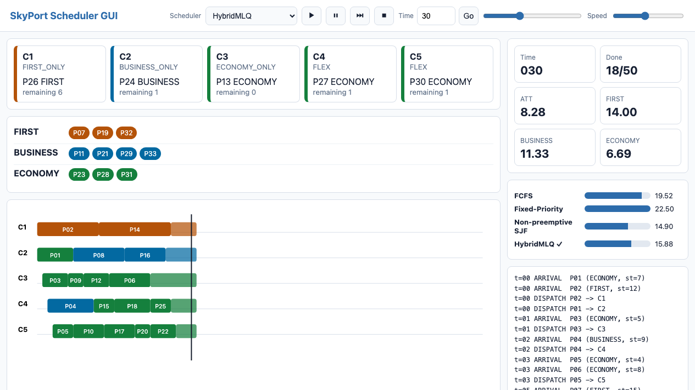

# SkyPort

공항 체크인 카운터를 CPU, 승객을 프로세스로 모델링한 비선점형 다중 프로세서 스케줄링 시뮬레이터입니다. 같은 입력에 대한 스케줄러별 평균 반환 시간(ATT)을 비교합니다.

### 프로젝트 소개

<p align="center">
  
</p>

### 핵심 기능

<p align="center">
  
</p>

### 시스템 아키텍처

<p align="center">
  
</p>

이 구조는 **스케줄링 정책을 쉽게 교체·비교**하고, 시뮬레이션 엔진이 CLI나 GUI 구현에 영향을 받지 않도록 분리하기 위해 선택했습니다.

또한 모든 출력이 동일한 `SimSnapshot`을 사용하므로 인터페이스가 달라도 일관된 결과를 보여주며, 각 구성요소를 독립적으로 테스트하고 확장하기 쉽습니다.

### 팀 구성

<table>
  <tr><td align="center"><a href="https://github.com/ken-jeong"></a></td><td><b>정상겸</b><br/><sub>Leader · Architecture</sub></td><td>전체 설계 · 시뮬레이션 엔진 · 스케줄러 4종 · 배포</td></tr>
  <tr><td align="center"><a href="https://github.com/eyes25"></a></td><td><b>김준서</b><br/><sub>Docs · Presentation</sub></td><td>프로젝트 문서 관리 · 발표</td></tr>
  <tr><td align="center"><a href="https://github.com/Rustica0411"></a></td><td><b>안현빈</b><br/><sub>Scheduling</sub></td><td>HybridMLQ 알고리즘 개선 · 테스트</td></tr>
</table>

## 기술 스택

Python 표준 라이브러리 · 정적 HTML

테스트에는 pytest, 논문 그림 생성에는 matplotlib을 사용합니다.

## 시작하기

### 사전 요구사항

- Python 3.10 이상

### 실행

별도 런타임 패키지 설치 없이 저장소 루트에서 실행합니다.

```bash
python3 main.py --input input.txt --scheduler hybrid
```

## 사용 방법

### 실행 옵션

```bash
python3 main.py --input input.txt --compare
python3 main.py --input input.txt --web out.html
python3 main.py --help
```

`--compare`는 스케줄러를 비교하고, `--web`으로 생성한 `out.html`은 브라우저에서 엽니다.
`--log`를 추가하면 도착·배정·완료 이벤트 로그를 출력합니다.

| `--scheduler` 값 | 방식 |
| --- | --- |
| `fcfs` | 도착 순서 |
| `priority` | 등급 우선순위 |
| `sjf` | 서비스 시간이 짧은 순 |
| `hybrid` | 등급별 큐·전용 카운터·work stealing·aging 조합 |

### 실행 화면



### 입력 파일

샘플은 [input.txt](input.txt)를 사용합니다. 도착 시각만 늘리고 줄여 부하를 바꾼 [input_light.txt](input_light.txt)·[input_heavy.txt](input_heavy.txt)로 부하별 결과를 비교할 수 있습니다. 열 순서와 허용값은 [입력 규약](docs/spec.md#요구사항)을 참고합니다.

### 제안 알고리즘과 실험 결과

HybridMLQ는 등급별 큐에서 SJF로 선택하고, 전용 카운터가 비면 다른 큐의 승객을 가져오며, 오래 대기한 Economy 승객에게 aging을 적용합니다. 설계 근거는 [논문](docs/HYBRID_MLQ_PAPER.pdf), 부하별 ATT와 aging 임계값 실험은 [검증 결과](docs/tasks.md#기준선)를 참고합니다.

<p align="center">
  
  
</p>

### 논문 빌드

matplotlib과 XeLaTeX가 설치된 환경에서 실행합니다.

```bash
python3 docs/generate_paper_figures.py
xelatex -output-directory=docs docs/HYBRID_MLQ_PAPER.tex
```

## 테스트

```bash
python3 -m venv .venv
source .venv/bin/activate
python -m pip install pytest
python -m pytest tests/
```

Windows PowerShell에서는 가상환경 활성화에 `.venv\Scripts\Activate.ps1`을 사용합니다.

## 관련 문서

[요구사항](docs/spec.md) → [구현 계획](docs/plan.md) → [작업 현황](docs/tasks.md) 순서로 확인합니다.

| 문서 | 내용 |
| --- | --- |
| [spec.md](docs/spec.md) | 입력·시뮬레이션 규칙·완료 기준 |
| [plan.md](docs/plan.md) | 코드 구조·스케줄러 확장·평가 방법 |
| [tasks.md](docs/tasks.md) | 진행 현황·부하별 ATT 기준선·aging 스윕 결과 |
| [논문 PDF](docs/HYBRID_MLQ_PAPER.pdf) | 설계 근거·평가·한계 |
| [논문 소스](docs/HYBRID_MLQ_PAPER.tex) | 논문 수정 및 재생성 원본 |
| [작업 지침](AGENTS.md) | 문서별 역할·변경 원칙 |
